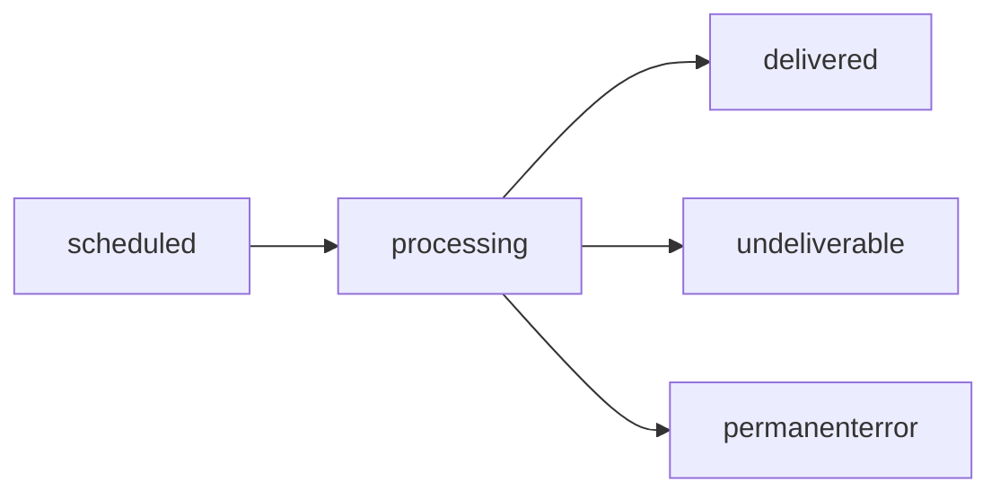

# Check Message Status

Track delivery status of your messages using the status check endpoint.

## Endpoint

```
GET /bat/message/{messageId}
```

## Request

### URL Parameters

| Parameter | Type | Required | Description |
|-----------|------|----------|-------------|
| `messageId` | string | Yes | Unique message identifier from send response |

### Authentication

Use any of the three authentication methods:

=== "API Key Header"

    ```bash
    curl -X GET https://restapi.smsbat.com/bat/message/abc123def456 \
      -H "X-Authorization-Key: your-api-key"
    ```

=== "HTTP Basic Auth"

    ```bash
    curl -X GET https://restapi.smsbat.com/bat/message/abc123def456 \
      -u "username:password"
    ```

=== "API Key as Password"

    ```bash
    curl -X GET https://restapi.smsbat.com/bat/message/abc123def456 \
      -u "@:your-api-key"
    ```

## Response

### Basic Response

```json
{
  "messagelistId": 123456,
  "messageId": "abc123def456",
  "deliverystatus": "delivered",
  "partscount": 1,
  "cost": 0.05
}
```

### Response Fields

| Field | Type | Description |
|-------|------|-------------|
| `messagelistId` | integer | Batch identifier |
| `messageId` | string | Unique message identifier |
| `deliverystatus` | string | Current delivery status |
| `partscount` | integer | Number of message parts |
| `cost` | number | Message cost in currency units |

### Extended Response (with Fallback)

When fallback is configured, response includes additional fields:

```json
{
  "messagelistId": 123456,
  "messageId": "abc123def456",
  "deliverystatus": "delivered",
  "partscount": 1,
  "cost": 0.05,
  "fallbacks": [
    {
      "type": "sms",
      "status": "not_used"
    }
  ],
  "extendedStatuses": {
    "viber": "delivered",
    "sms": "not_used"
  },
  "rate": 0.05,
  "rateAmount": 0.05,
  "rateCurrency": "USD",
  "billAmount": 0.05,
  "billCurrency": "USD"
}
```

## Delivery Status Values

| Status | Description |
|--------|-------------|
| `scheduled` | Queued for sending |
| `processing` | Currently being sent |
| `delivered` | Successfully delivered |
| `undeliverable` | Delivery failed, message rejected |
| `permanenterror` | Removed from queue due to persistent error |

## Status Lifecycle



### Scheduled

Message is accepted and queued for delivery:

```json
{
  "deliverystatus": "scheduled",
  "partscount": 1
}
```

### Processing

Message is currently being sent to recipient:

```json
{
  "deliverystatus": "processing",
  "partscount": 1
}
```

### Delivered

Message successfully delivered to recipient:

```json
{
  "deliverystatus": "delivered",
  "partscount": 1,
  "cost": 0.05
}
```

### Undeliverable

Message could not be delivered (invalid number, network error):

```json
{
  "deliverystatus": "undeliverable",
  "partscount": 1,
  "cost": 0.00
}
```

### Permanent Error

Message removed from queue due to persistent delivery issues:

```json
{
  "deliverystatus": "permanenterror",
  "partscount": 1,
  "cost": 0.00
}
```

## Check Multiple Messages

Check status for multiple messages in your application:

```javascript
// JavaScript example
async function checkMessageStatuses(messageIds) {
  const statuses = await Promise.all(
    messageIds.map(async (messageId) => {
      const response = await fetch(
        `https://restapi.smsbat.com/bat/message/${messageId}`,
        {
          headers: {
            'X-Authorization-Key': 'your-api-key'
          }
        }
      );
      return response.json();
    })
  );

  return statuses;
}

// Usage
const messageIds = ['abc123', 'def456', 'ghi789'];
const statuses = await checkMessageStatuses(messageIds);

statuses.forEach(status => {
  console.log(`Message ${status.messageId}: ${status.deliverystatus}`);
});
```

## Polling for Status Updates

Poll the status endpoint to track delivery:

```javascript
// Poll every 5 seconds until delivered
async function waitForDelivery(messageId, maxAttempts = 12) {
  for (let i = 0; i < maxAttempts; i++) {
    const response = await fetch(
      `https://restapi.smsbat.com/bat/message/${messageId}`,
      {
        headers: { 'X-Authorization-Key': 'your-api-key' }
      }
    );

    const status = await response.json();

    if (status.deliverystatus === 'delivered') {
      return { success: true, status };
    }

    if (status.deliverystatus === 'undeliverable' ||
        status.deliverystatus === 'permanenterror') {
      return { success: false, status };
    }

    // Wait 5 seconds before next check
    await new Promise(resolve => setTimeout(resolve, 5000));
  }

  // Timeout after 60 seconds
  return { success: false, timeout: true };
}
```

## Webhook Alternative

Instead of polling, use webhooks for real-time status updates:

```json
POST https://your-server.com/webhook
{
  "messageId": "abc123def456",
  "deliverystatus": "delivered",
  "timestamp": "2025-01-23T10:30:00Z",
  "cost": 0.05
}
```

Contact your account manager to configure webhook URL.

## Implementation Examples

### Python

```python
import requests
import time

def check_status(message_id, api_key):
    url = f"https://restapi.smsbat.com/bat/message/{message_id}"
    headers = {"X-Authorization-Key": api_key}

    response = requests.get(url, headers=headers)
    return response.json()

def wait_for_delivery(message_id, api_key, timeout=60):
    """Poll until delivered or timeout"""
    start_time = time.time()

    while time.time() - start_time < timeout:
        status = check_status(message_id, api_key)

        if status['deliverystatus'] == 'delivered':
            return {'success': True, 'status': status}

        if status['deliverystatus'] in ['undeliverable', 'permanenterror']:
            return {'success': False, 'status': status}

        time.sleep(5)

    return {'success': False, 'timeout': True}

# Usage
message_id = "abc123def456"
result = wait_for_delivery(message_id, "your-api-key")

if result['success']:
    print(f"Message delivered! Cost: {result['status']['cost']}")
else:
    print("Message delivery failed or timeout")
```

### PHP

```php
<?php

function checkStatus($messageId, $apiKey) {
    $url = "https://restapi.smsbat.com/bat/message/" . $messageId;

    $ch = curl_init($url);
    curl_setopt($ch, CURLOPT_RETURNTRANSFER, true);
    curl_setopt($ch, CURLOPT_HTTPHEADER, [
        "X-Authorization-Key: " . $apiKey
    ]);

    $response = curl_exec($ch);
    curl_close($ch);

    return json_decode($response, true);
}

function waitForDelivery($messageId, $apiKey, $timeout = 60) {
    $startTime = time();

    while (time() - $startTime < $timeout) {
        $status = checkStatus($messageId, $apiKey);

        if ($status['deliverystatus'] === 'delivered') {
            return ['success' => true, 'status' => $status];
        }

        if (in_array($status['deliverystatus'],
                    ['undeliverable', 'permanenterror'])) {
            return ['success' => false, 'status' => $status];
        }

        sleep(5);
    }

    return ['success' => false, 'timeout' => true];
}

// Usage
$messageId = "abc123def456";
$result = waitForDelivery($messageId, "your-api-key");

if ($result['success']) {
    echo "Message delivered! Cost: " . $result['status']['cost'];
} else {
    echo "Message delivery failed or timeout";
}
```

### Node.js

```javascript
const axios = require('axios');

async function checkStatus(messageId, apiKey) {
  const response = await axios.get(
    `https://restapi.smsbat.com/bat/message/${messageId}`,
    {
      headers: { 'X-Authorization-Key': apiKey }
    }
  );

  return response.data;
}

async function waitForDelivery(messageId, apiKey, timeout = 60000) {
  const startTime = Date.now();

  while (Date.now() - startTime < timeout) {
    const status = await checkStatus(messageId, apiKey);

    if (status.deliverystatus === 'delivered') {
      return { success: true, status };
    }

    if (['undeliverable', 'permanenterror'].includes(
      status.deliverystatus
    )) {
      return { success: false, status };
    }

    // Wait 5 seconds
    await new Promise(resolve => setTimeout(resolve, 5000));
  }

  return { success: false, timeout: true };
}

// Usage
const messageId = 'abc123def456';
const result = await waitForDelivery(messageId, 'your-api-key');

if (result.success) {
  console.log(`Message delivered! Cost: ${result.status.cost}`);
} else {
  console.log('Message delivery failed or timeout');
}
```

## Best Practices

### Polling Frequency

- ✅ Poll every 5-10 seconds
- ✅ Implement exponential backoff
- ✅ Set reasonable timeout (60-120 seconds)
- ❌ Don't poll more than once per second
- ❌ Don't poll indefinitely

### Error Handling

```javascript
async function checkStatusWithRetry(messageId, apiKey, retries = 3) {
  for (let i = 0; i < retries; i++) {
    try {
      const response = await fetch(
        `https://restapi.smsbat.com/bat/message/${messageId}`,
        {
          headers: { 'X-Authorization-Key': apiKey }
        }
      );

      if (!response.ok) {
        throw new Error(`HTTP ${response.status}`);
      }

      return await response.json();
    } catch (error) {
      if (i === retries - 1) throw error;

      // Wait before retry (exponential backoff)
      await new Promise(resolve =>
        setTimeout(resolve, Math.pow(2, i) * 1000)
      );
    }
  }
}
```

### Caching

Cache status results to reduce API calls:

```javascript
const statusCache = new Map();

async function getCachedStatus(messageId, apiKey, cacheTTL = 30000) {
  const cached = statusCache.get(messageId);

  if (cached && Date.now() - cached.timestamp < cacheTTL) {
    return cached.status;
  }

  const status = await checkStatus(messageId, apiKey);

  statusCache.set(messageId, {
    status,
    timestamp: Date.now()
  });

  return status;
}
```

### Batch Processing

When checking many messages, batch requests:

```javascript
async function checkBatchStatus(messageIds, apiKey, batchSize = 10) {
  const results = [];

  for (let i = 0; i < messageIds.length; i += batchSize) {
    const batch = messageIds.slice(i, i + batchSize);
    const batchResults = await Promise.all(
      batch.map(id => checkStatus(id, apiKey))
    );
    results.push(...batchResults);

    // Rate limiting
    if (i + batchSize < messageIds.length) {
      await new Promise(resolve => setTimeout(resolve, 1000));
    }
  }

  return results;
}
```

## Use Cases

### Order Confirmation

Track delivery of order confirmation messages:

```javascript
const orderMessage = await sendMessage({
  to: customer.phone,
  text: `Order #${orderId} confirmed`
});

// Wait for delivery
const result = await waitForDelivery(orderMessage.messageId, apiKey);

if (result.success) {
  await updateOrder(orderId, { notificationSent: true });
} else {
  await scheduleRetry(orderId);
}
```

### Two-Factor Authentication

Verify OTP delivery before timeout:

```javascript
const otpMessage = await sendOTP(userPhone, otpCode);

// Poll for delivery
const delivered = await waitForDelivery(
  otpMessage.messageId,
  apiKey,
  30 // 30 second timeout
);

if (!delivered.success) {
  // Send via alternative channel
  await sendEmailOTP(userEmail, otpCode);
}
```

### Marketing Campaigns

Track campaign message delivery rates:

```javascript
const messageIds = await sendCampaign(recipientList);

// Check all statuses after 5 minutes
setTimeout(async () => {
  const statuses = await checkBatchStatus(messageIds, apiKey);

  const delivered = statuses.filter(s =>
    s.deliverystatus === 'delivered'
  ).length;

  console.log(`Delivery rate: ${delivered / statuses.length * 100}%`);
}, 5 * 60 * 1000);
```

## Next Steps

- [Send Message](send-message.md) - Learn how to send messages
- [Delivery Status Guide](../../using-smsbat/delivery-status.md) - Understand delivery statuses
- [Fallback Strategies](../../using-smsbat/fallback.md) - Configure fallbacks
