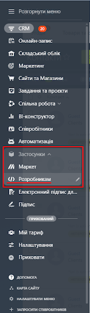
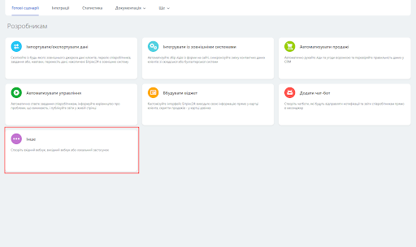
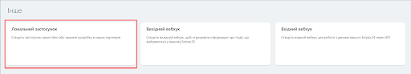
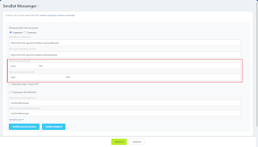
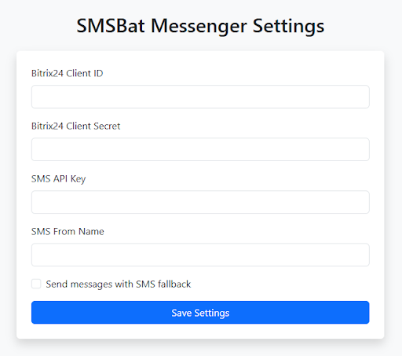
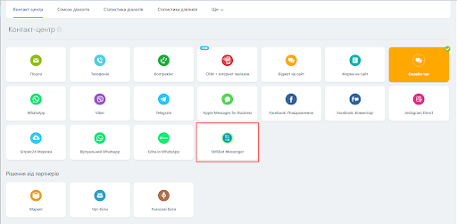

# Bitrix24 Integration

Install the SMSBAT Messenger app in [Bitrix24](https://www.bitrix24.com/) to send Viber and SMS messages directly from your Bitrix24 Contact Center. This guide covers step-by-step installation and configuration.

## Overview

The SMSBAT integration with Bitrix24 allows you to:

- Send Viber messages to clients from Bitrix24
- Use SMS fallback when Viber delivery fails
- Manage messaging through the Bitrix24 Contact Center
- Connect SMSBAT as an Open Line channel

## Prerequisites

- An active SMSBAT account with an API key
- A Bitrix24 account with administrator access
- An SMS sender name (From Name) registered with SMSBAT

## Installation

### Step 1: Open the Developer Section

Navigate to **Applications > Developers** in your Bitrix24 menu.

### Step 2: Go to the "Other" Tab

In the developer section, switch to the **Other** tab to find additional application types.

### Step 3: Select "Local Application"

Choose **Local Application** from the available options.

### Step 4: Configure Application Settings

Fill in the following application settings:

| Parameter | Value |
|-----------|-------|
| **Application type** | Server |
| **Handler URL** | `https://freshchats.ponderacode.com/handler.php` |
| **Initial setup URL** | `https://freshchats.ponderacode.com/install.php` |

Set the following **permissions**:

| Permission | Code |
|------------|------|
| Open Lines | `imopenlines` |
| External messenger connectors | `imconnector` |
| Message service | `messageservice` |

### Step 5: Save the Application

Click the **Save** button to register the application.

### Step 6: Copy Application Credentials

After saving, Bitrix24 will generate unique credentials for the application:

- **client_id** - Application code
- **client_secret** - Application secret key

!!! warning "Important"
    Copy and save both `client_id` and `client_secret` values immediately. You will need them in the next step.

### Step 7: Open the Application Settings

Click the **Go to Application** button to open the SMSBAT Messenger Settings page.

Fill in the following fields:

| Field | Description |
|-------|-------------|
| **Bitrix24 Client ID** | The `client_id` from the previous step |
| **Bitrix24 Client Secret** | The `client_secret` from the previous step |
| **SMS API Key** | Your personal API key from SMSBAT |
| **SMS From Name** | The sender name for outgoing messages |
| **Send messages with SMS fallback** | Enable to use Viber + SMS fallback delivery |

!!! info "SMS Fallback"
    When **Send messages with SMS fallback** is enabled, messages will be delivered via both Viber and SMS channels. If disabled, messages will be sent via Viber only.

Click **Save Settings** to apply the configuration.

### Step 8: Activate in Contact Center

Navigate to the **Contact Center** section in Bitrix24 and activate the **SMSBat Messenger** channel.

### Step 9: Start Using

After the setup is complete, you can start sending messages to clients through the SMSBAT Messenger channel in your Bitrix24 Contact Center.

## Settings Reference

| Setting | Description | Required |
|---------|-------------|----------|
| Bitrix24 Client ID | OAuth application code from Bitrix24 | Yes |
| Bitrix24 Client Secret | OAuth application secret from Bitrix24 | Yes |
| SMS API Key | Your SMSBAT API key | Yes |
| SMS From Name | Sender name displayed to recipients | Yes |
| Send messages with SMS fallback | Enable Viber + SMS fallback delivery | No |

## Troubleshooting

### Application is not visible in Contact Center

1. Verify the application was saved successfully in Step 5
2. Check that all required permissions (imopenlines, imconnector, messageservice) are granted
3. Try refreshing the Contact Center page

### Messages are not being sent

1. Verify your SMS API Key is correct in the application settings
2. Check that the SMS From Name matches your registered sender name
3. Ensure the recipient's phone number is in the correct format
4. If using SMS fallback, verify your SMSBAT account has SMS credits

### Application credentials lost

If you lost your `client_id` or `client_secret`, navigate to **Applications > Developers**, find the SMSBAT Messenger application, and view its details to retrieve the credentials.

## Next Steps

- [SMSBAT API](../api/smsbat/index.md) - Learn about sending messages via API
- [Cascade API](../api/cascade/index.md) - Set up multi-channel message delivery
- [Message Types](../using-smsbat/message-types.md) - Explore available message types
- [Fallback Strategies](../using-smsbat/fallback.md) - Configure fallback delivery
